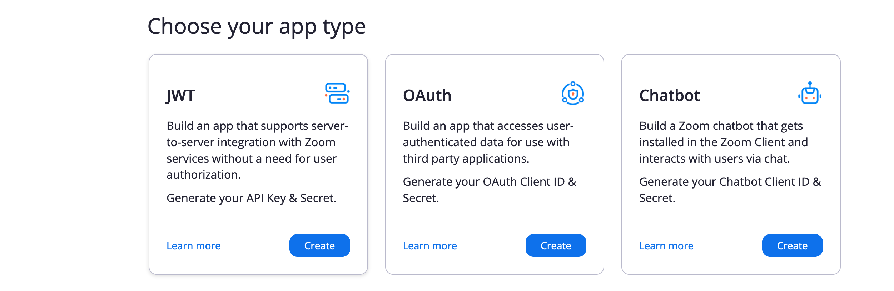
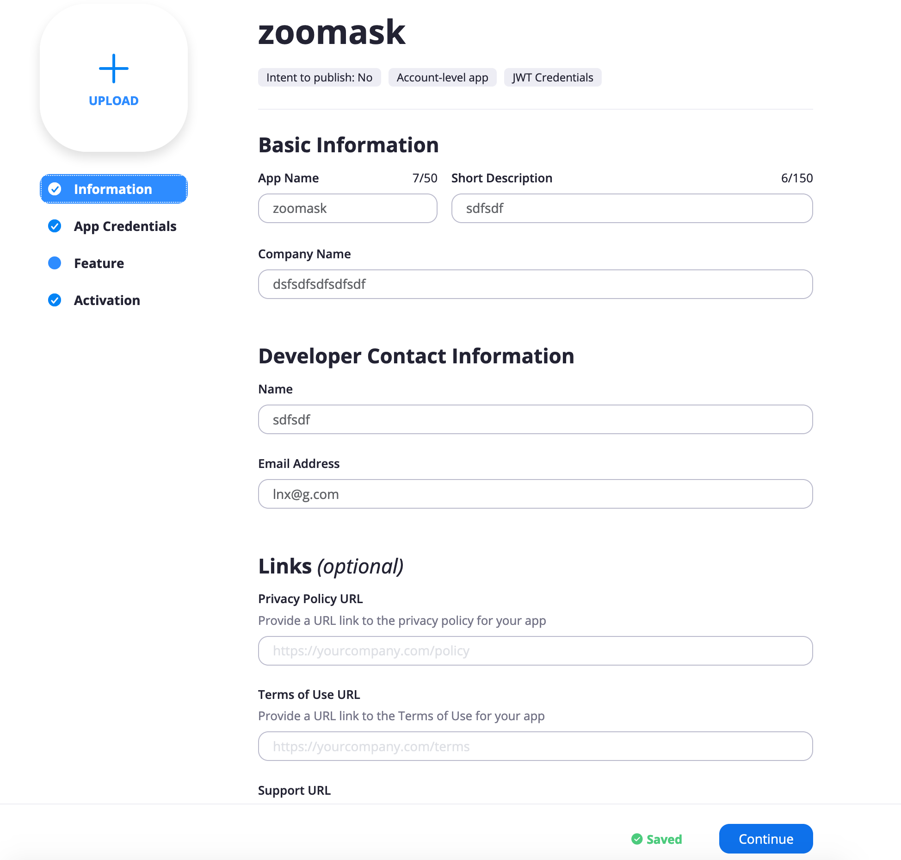
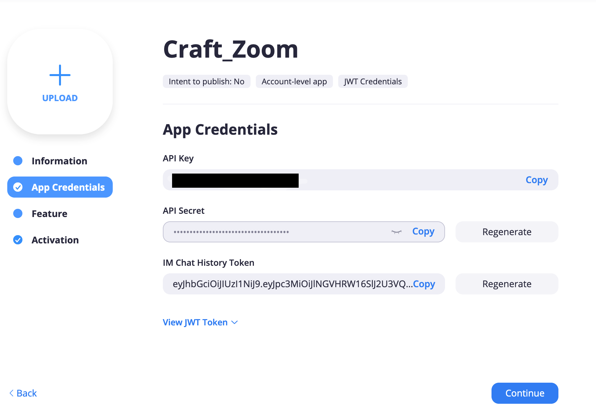
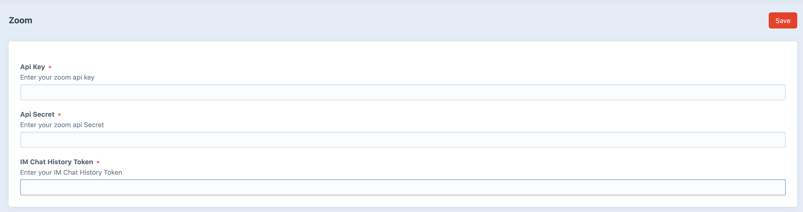
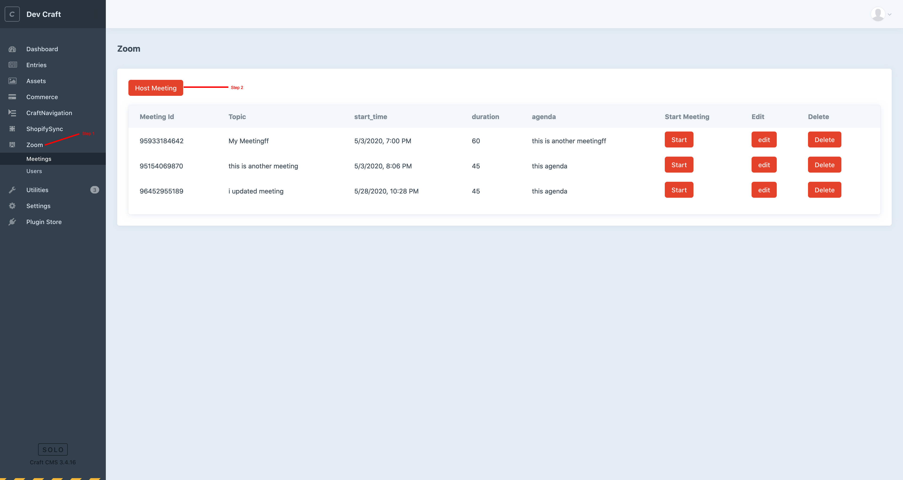
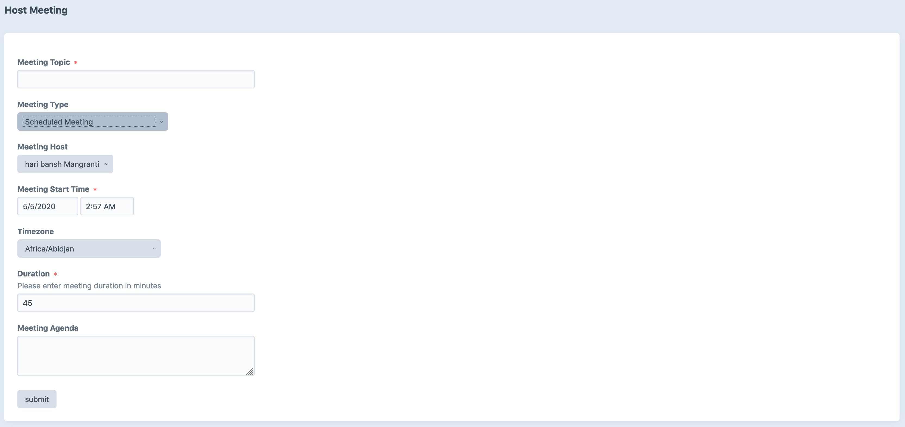
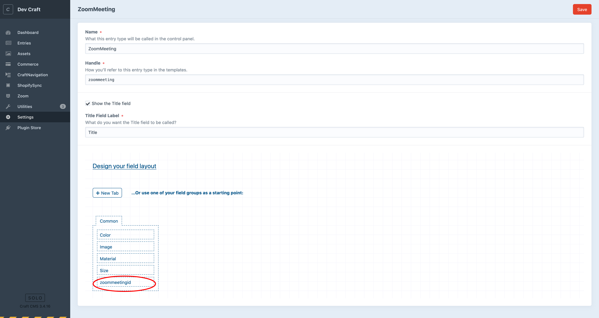
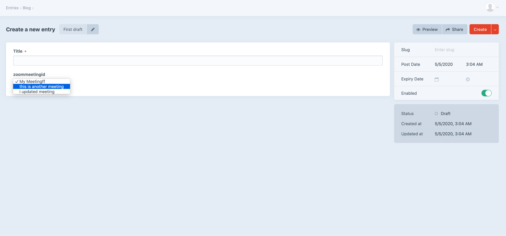

# Zoom plugin for Craft CMS 3.x

Zoom Video Conferencing plugin for Craft CMS

## Requirements

This plugin requires Craft CMS 3.0.0-beta.23 or later.

## Zoom Overview

This plugins enables user to utilize zoom video conferencing to their website. 
It provides facilities to embed zoom meeting into website.

## Configuring Zoom
Firstly you need to obtain zoom API keys in order to work ahead. please follow the following steps to obtain API Keys

* Firstly Sign up for Zoom account by visiting https://zoom.us" .(if you already have please skip this step)
* Once your account is activated, please visit this link https://marketplace.zoom.us/develop/create 
* Please Choose JWT app and click on Create

* Give your JWT app a name and click on create
* Fill your necessary information and click continue.

* you should be able to generate App Credentials at this stage.

* Once you have api keys, go to the plugins settings page and enter details.

## Using Zoom

In order to use the Zoom plugin in your website, Please follow following steps 
* Click on Zoom menu 
* click on Host Meeting

* Enter all the details. (*All the fields are marked as necessary)

* Click Submit.

 * Go to Settings > Section and Add new Section
 * Edit the newly created section and add custom field named "zoommeetingid"
 
 
 
* click save

## Templating Zoom Meeting Page

Once you have created custom entry types with zoommeetingfield, you can access 
all the meetings that have been created from your entry page.
like shown in screenshots

    
    In order to give custom look and feel zoom plugin comes with custom plugin variable.
    Go to the designated template for your custom page type that have been created.
    add following variable to fetch meetig

craft.zoom.get_meetingById(entry.zoommeetingid[0])

craft.zoom.get_meetingById() expects integer parameters (in this case its entry.zoommeetingid[0]).

it will return

                            'topic',
                            'timezone',
                            'start_time',
                            'status',
                            'start_meeting',
                            'join_meeting',
                            'join_meeting_byBrowser'
                            'password',
                            
                            
        
## TODO

Some things to do, and ideas for potential features:

* Add Webinar Features
* Add Poll
* Reporting

Brought to you by [Fatfish](https://www.fatfish.com.au)
